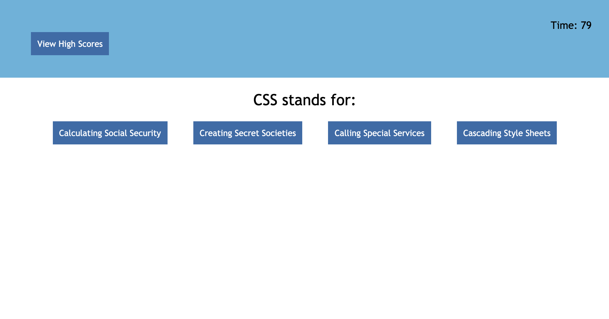

# Code Quiz
This short 5 question quiz will prompt the user with beginner coding-related questions, and the user will have four multiple-choice answers to choose from. The user has 90 seconds to complete the quiz, and at the end will have a chance to input their initials to be included on a list of past scores.
## Built With
* Javascript
* CSS
* HTML
# Deployed URL
https://kesiahp18.github.io/code-quiz/

